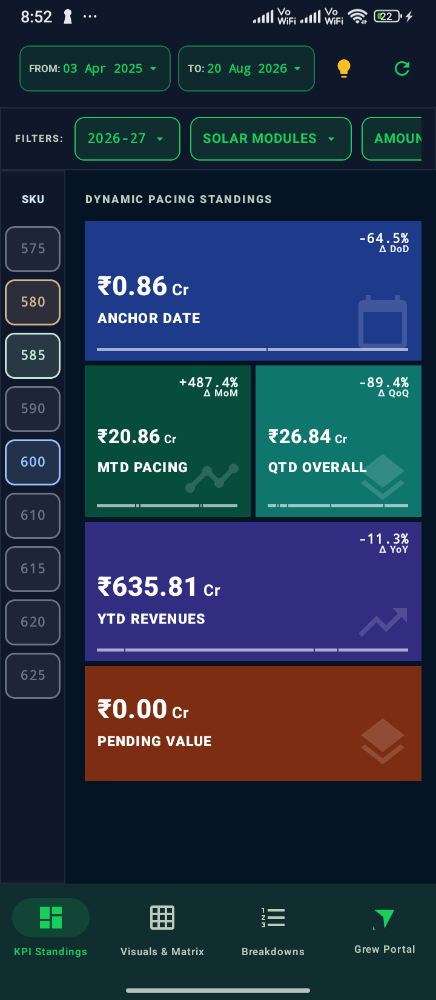
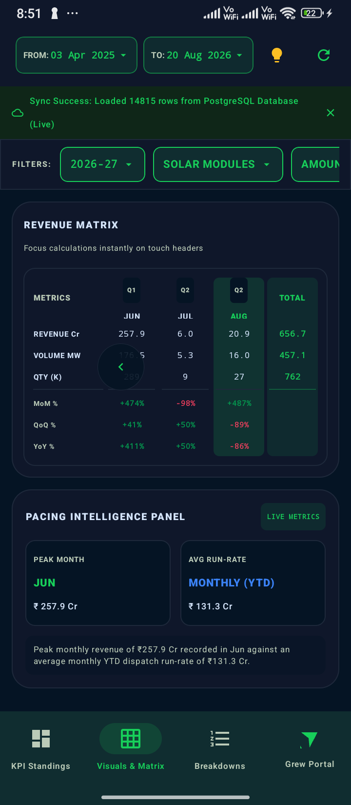
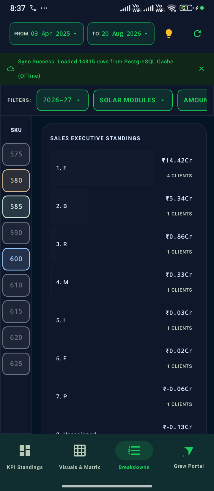
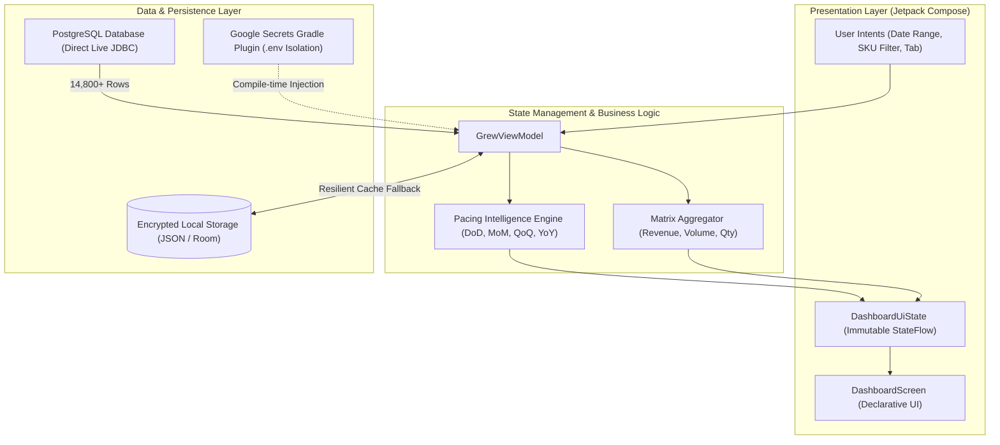

# ⚡ Grew Revenue & Pacing Intelligence Platform

[](https://kotlinlang.org)
[-green.svg?style=for-the-badge&logo=android)](https://developer.android.com)
[](https://developer.android.com/jetpack/compose)
[](https://www.postgresql.org)
[](https://developer.android.com/topic/architecture)

> **Enterprise-grade Native Android application delivering real-time revenue analytics, fiscal pacing intelligence, and SKU-level dispatch metrics across ₹650+ Cr in transaction volume.**

---

## 📱 Visual Showcase

<div align="center">
  <table>
    <tr>
      <td align="center" width="33%">
        <b>Dynamic KPI Standings</b><br/>
        <sub>Anchor Date DoD, MTD MoM, QTD QoQ, YTD YoY</sub><br/><br/>
        
      </td>
      <td align="center" width="33%">
        <b>Visuals & Revenue Matrix</b><br/>
        <sub>Sticky headers, auto-scroll to latest month, YTD run-rate</sub><br/><br/>
        
      </td>
      <td align="center" width="33%">
        <b>Client & SKU Breakdowns</b><br/>
        <sub>Leaderboards, volume MW, and client market share</sub><br/><br/>
        
      </td>
    </tr>
  </table>
</div>

---

## 🎯 Executive Overview & Business Impact

The **Grew Revenue Platform** provides solar energy manufacturing executives with sub-second, mission-critical business intelligence. Designed to process **14,800+ live dispatch rows** directly from enterprise PostgreSQL databases, it turns raw transaction tables into actionable pacing insights.

### Key Capabilities
- **Single-Day Anchor Date Analysis**: Instantaneous calculation of single-day sales (`Anchor Date = TO Date`) compared against the previous active trading day (`∆ DoD`).
- **Fiscal Calendar Alignment**: Full compliance with the Indian Financial Year (`Apr 1` – `Mar 31`), evaluating Q1 through Q4 performance dynamically.
- **YTD Pacing Engine**: Real elapsed-month pacing (`₹131.3 Cr/mo`) avoiding artificial dilution from future unelapsed months.
- **Enterprise Offline Resilience**: Instant launch (0ms latency) via encrypted local cache with background synchronization to live PostgreSQL clusters.

---

## 🏗️ System Architecture

The application is structured following **Modern Android Architecture (MVI / Unidirectional Data Flow)**, ensuring strict separation of concerns, testability, and deterministic UI state rendering.



---

## 💻 Tech Stack & Engineering Highlights

| Category | Technology | Usage & Architectural Rationale |
|---|---|---|
| **Language** | **Kotlin 2.0.21** | Type-safe, coroutines-first, high performance |
| **UI Framework** | **Jetpack Compose (BOM 2024.10)** | 100% declarative UI, zero legacy XML views, smooth 60fps animations |
| **State Management** | **StateFlow & MVI Pattern** | Unidirectional Data Flow guaranteeing deterministic state |
| **Database** | **PostgreSQL (v42.7 JDBC)** | High-throughput direct database queries across large dispatch datasets |
| **Local Cache** | **Offline-First Storage** | Immediate local render on cold start with asynchronous live delta sync |
| **Secrets Engine** | **`secrets-gradle-plugin`** | Build-time secret injection preventing credential leakage in Git |
| **Async & Concurrency** | **Kotlin Coroutines & Dispatchers.IO** | Non-blocking database I/O and parallel metric computation |
| **Design System** | **Material 3 (Dark Theme)** | Tailored palette (Navy, Brand Green `#10B981`, Slate) optimized for mobile clarity |

---

## 🔍 Deep-Dive: Engineering Challenges & Solutions

### 1. Pacing Intelligence Engine (DoD, MoM, QoQ, YoY)
* **Problem**: Standard analytics tools calculate Day-over-Day comparisons using calendar `Day - 1`. If yesterday was a Sunday or national holiday with 0 dispatches, the metric reported `-100%`, distorting executive perception.
* **Solution**: Engineered a dynamic historical lookback algorithm that traverses backwards through chronological dispatches to locate the **most recent active trading day with sales > 0**. On 20 Aug (`₹0.86 Cr`), it accurately benchmarks against 19 Aug (`₹2.41 Cr`), rendering a true `-64.5% ∆ DoD`.

### 2. Fiscal YTD Run-Rate vs. Incomplete Financial Years
* **Problem**: In an ongoing financial year (e.g., Apr–Aug, 5 elapsed months), dividing cumulative YTD revenue by 12 months artificially deflates the run-rate (showing ₹54.7 Cr instead of ₹131.3 Cr).
* **Solution**: Implemented dynamic elapsed-month filtering (`monthlyItems.filter { it.revenueCr > 0.0 }`). The run-rate automatically adapts as new calendar months elapse, labeled explicitly as **`MONTHLY (YTD)`**.

### 3. Responsive Matrix Grid with Sticky Headers & Smart Scroll
* **Problem**: Executive dashboards contain multi-column financial matrices that overflow mobile screens. Standard horizontal scroll tables clip column titles or disorient users by defaulting to April (5 months behind).
* **Solution**:
  - Applied `Modifier.width(IntrinsicSize.Max)` to sticky metric headers (`REVENUE Cr`, `VOLUME MW`, `QTY (K)`), ensuring zero label truncation.
  - Implemented `LaunchedEffect` auto-scroll positioning users at the **latest month and fiscal total** upon opening the tab, while retaining smooth left-scroll navigation via drag gestures or assist chevrons (`<`).

### 4. Zero Secrets in Version Control (Enterprise Security)
* **Problem**: Database passwords and connection URLs hardcoded in source code risk exposure when committed to public or team repositories.
* **Solution**: Integrated Google's `secrets-gradle-plugin`. Production credentials are read from `.env` (git-ignored) and injected into `BuildConfig` at compile time. An `.env.example` template is committed with placeholders, ensuring the repository is 100% safe for public audits and CI/CD pipelines.

---

## 🛠️ Project Structure

```
RevenueApk/
├── app/
│   ├── src/main/
│   │   ├── java/com/example/
│   │   │   ├── MainActivity.kt          # Single-Activity entry point
│   │   │   ├── GrewApplication.kt      # Application-level singleton context
│   │   │   ├── data/
│   │   │   │   └── GrewData.kt          # Transaction entity models & Enums
│   │   │   └── ui/
│   │   │       ├── DashboardScreen.kt   # Compose UI: KPI Standings, Matrix, Breakdowns
│   │   │       ├── GrewViewModel.kt     # Pacing Engine, StateFlow, Database sync
│   │   │       └── theme/               # Color, Typography, and Theme system
│   │   ├── res/                         # Vector drawables, mipmaps, strings
│   │   └── AndroidManifest.xml
│   ├── build.gradle.kts                 # Secrets plugin, Compose compiler, dependencies
│   └── proguard-rules.pro
├── docs/
│   └── screenshots/                     # UI visual documentation
├── .env.example                         # Safe configuration template
├── .gitignore                           # Excludes .env, keystores, build artifacts
└── settings.gradle.kts
```

---

## 🚀 Getting Started

### Prerequisites
- **Android Studio Ladybug (2024.2+)** or newer
- **JDK 21** (`JAVA_HOME` pointing to Java 21)
- Physical Android Device or Emulator running **API 26 (Android 8.0)** or higher

### Installation & Run

1. **Clone the Repository**:
   ```bash
   git clone https://github.com/Navneet831/revenueapk.git
   cd revenueapk
   ```

2. **Configure Environment Secrets**:
   Copy the template and fill in your database/service configuration:
   ```bash
   cp .env.example .env
   ```
   Edit `.env` with your credentials:
   ```properties
   POSTGRES_HOST=80.225.203.238
   POSTGRES_PORT=5432
   POSTGRES_DB=Grewdb
   POSTGRES_USER=your_user
   POSTGRES_PASSWORD=your_password
   ```

3. **Build and Install on Device**:
   ```bash
   ./gradlew assembleDebug
   adb install -r app/build/outputs/apk/debug/app-debug.apk
   ```

---

## 👨‍💻 Author & Contact

**Navneet Chaudhary**
- **GitHub**: [@Navneet831](https://github.com/Navneet831)
- **Email**: `navneet.chaudhary831@gmail.com`
- **Focus**: Android Engineering • Jetpack Compose • Enterprise Data Architecture

---
*Built with modern Android standards, Clean Architecture, and performance optimization for executive leadership.*
